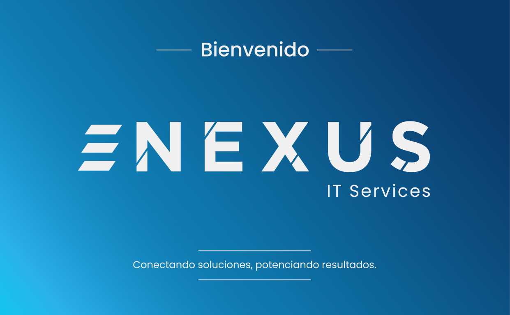
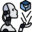
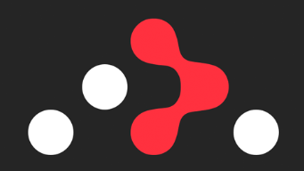
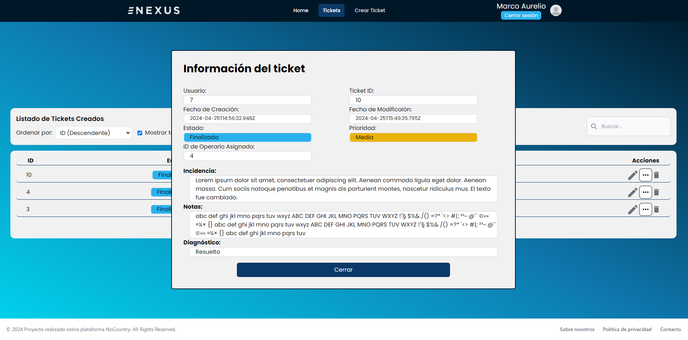
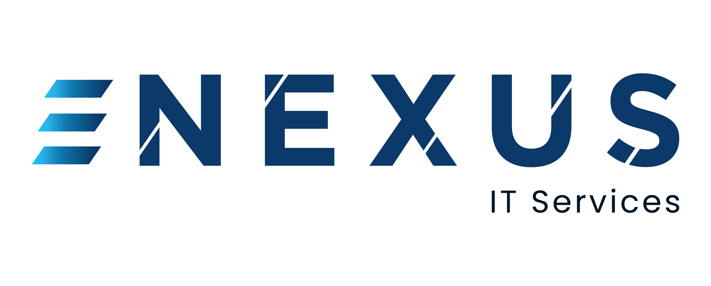

 # Ticketera Nexus
  
 Es una empresa líder en el sector de servicios de tecnología de la información (IT) dedicada a proporcionar soluciones integrales para empresas de todos los tamaños. Se especializa en la venta y mantenimiento de outsourcing de sistemas IT.

 


### *Servicios:*

- ***Venta de Sistemas IT:*** amplia gama de productos y soluciones de hardware y software, adaptados a las necesidades específicas de cada cliente. Desde equipos de red hasta licencias de software, proporcionan las mejores opciones que impulsen la eficiencia y el rendimiento de los sistemas IT de los clientes.

- ***Mantenimiento Preventivo y Correctivo:*** cuentan con un equipo de técnicos altamente calificados para mantener el funcionamiento de los sistemas IT en su punto óptimo. Además, tienen disponibilidad las 24 horas del día, los 7 días de la semana, para atender cualquier incidencia y resolver problemas de manera rápida y eficiente.

- ***Outsourcing de Sistemas IT:*** proporcionan servicios de outsourcing completos para gestionar y mantener sistemas IT, desde la gestión de servidores hasta el soporte técnico para usuarios finales.

### *Valores:*

- ***Experiencia:*** con años de experiencia en el sector, cuentan con el conocimiento y la expertise necesaria para ofrecer soluciones tecnológicas de vanguardia y adaptadas a las necesidades específicas de cada cliente.

- ***Atención Personalizada:*** servicio personalizado y orientado al cliente. Trabajan en estrecha colaboración con cada empresa para entender sus objetivos y ofrecer soluciones que impulsen su crecimiento y éxito.

- ***Innovación Continua:*** se mantienen al tanto de las últimas tendencias y avances tecnológicos para ofrecer las soluciones más innovadoras y eficientes. Se enfocan en mejorar constantemente los servicios para satisfacer las demandas cambiantes del mercado.

***Nexus - IT Services tiene como objetivo ser el socio tecnológico de confianza para empresas que buscan optimizar sus sistemas IT y mejorar su competitividad en el mercado.***

##  Deploy

https://ticketera-production.onrender.com/login

##  Integrantes

####  *TL*

 [Lorena Barrera](https://www.linkedin.com/in/lorenabarr/)

####  *Frontend*

 [Xavier Basurto](https://www.linkedin.com/in/xavier-basurto-1969b286/)

 [Leandro Brangi](https://www.linkedin.com/in/leandro-brangi/)

 [Ezequiel Rindello](https://www.linkedin.com/in/ezequiel-rindello/)

 [Tomas Aquino](https://www.linkedin.com/in/tomas-gabriel-aquino-bajusz/)

####  *Backend*
 [David Nobati](https://www.linkedin.com/in/david-nobati-33756a26b/)

####  *UX / UI*
 [Romina Pompolo](https://www.linkedin.com/in/paola-romina-pompolo-15b04b178/)
#### *QA*
 [Danaysi Lazo](https://www.linkedin.com/in/danaysi-lazo/) 

 [Silvana Loureiro](https://www.linkedin.com/in/silvana-loureiro)

##  Método de organización
- Coordinamos Daily 
- Scrum
##  Tecnologías usadas

| *Frontend* |
| ------- |
|  HTML5 |
|  CSS3 |
|  [React](https://react.dev/) |
|  [Material UI icons](https://mui.com/) |
| [axios](https://www.npmjs.com/package/axios)|
|  [font-awesome](https://www.npmjs.com/package/font-awesome)|
| [Redux Toolkit](https://redux-toolkit.js.org/)|
| [dotenv](https://www.npmjs.com/package/dotenv)|
| [react-icons](https://www.npmjs.com/package/react-icons)|
| [react-router-dom](https://www.npmjs.com/package/react-router-dom)|
|  [sweetalert2](https://www.npmjs.com/package/sweetalert2)|
| [vite](https://vitejs.dev/)|


| *BackEnd* |
| -------- |
| [ NodeJS](https://nodejs.org/en) |
|  [Railway](https://railway.app/) |
| [axios](https://www.npmjs.com/package/axios)|
| [cors](https://www.npmjs.com/package/cors)|
| [dotenv](https://www.npmjs.com/package/dotenv)|
| [express](https://www.npmjs.com/package/express)|
| [nodemon](https://www.npmjs.com/package/nodemon)|
| [sequelize](https://sequelize.org/)|


| *Testing* |
| ------------ |
|  [Postman](https://www.postman.com/) |
| [SeleniumIDE](https://www.selenium.dev/)|


| *UX / UI* |
| ------------ |
|  Figma |
|  [Photoshop](https://www.adobe.com/pe/products/photoshop.html)|

##  Pantallas

### *Cliente:*

- Crear / Ver / Eliminar / Editar ticket:
 

- Agregar Nota:


- Búsqueda y filtarado:


- Vista de ticket finalizado:
 

### *Administrador*

#### Ticket
- Asignar:


- Búsqueda y filtrado:


#### Usuarios
- Búsqueda y filtarado:


- Editar / Banear Usuario:


- Registro de Empresa y cliente:


### *Operador*

- Desasignarse / Asignarse / Resolver Ticket:


 

## Inicializar Proyecto Ticketera Nexus (Front)

1. clonación de Repositorio
```git
  git clone https://github.com/No-Country/c17-32-node-react.git
```

2. Instalación de dependencias, dentro de la carpeta **cliente**
```node
  npm install
```

3. Correr la  App
```node
  npm run dev
```
